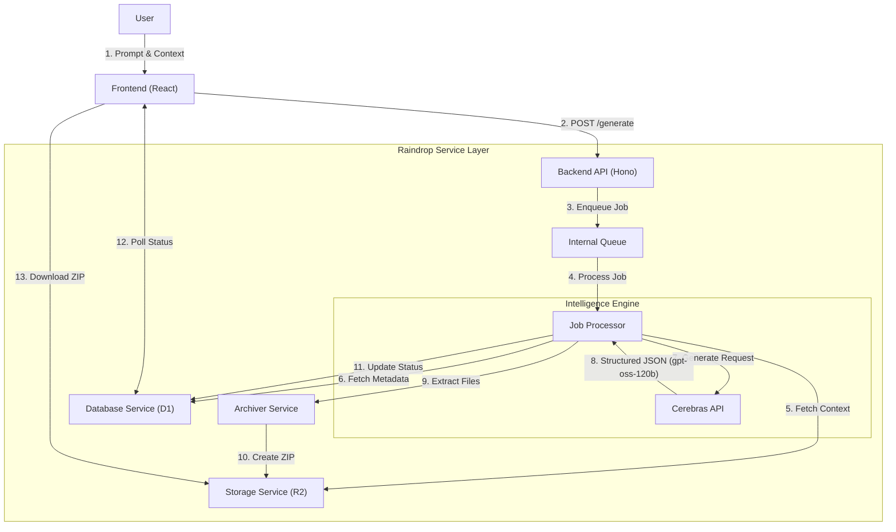

# System Architecture Report: Raindrop AI Extension Builder

This report details the architectural composition of the **AI Extension Builder**, focusing on its integration with LiquidMetal AI, Raindrop Services, Vultr, and Cerebras.

## 1. Executive Summary

The AI Extension Builder is a modern, scalable application built on the **Raindrop Framework** (developed by **LiquidMetal AI**). It leverages **Cerebras** for ultra-low latency AI inference to generate Chrome extensions in near real-time. The system is designed to run on edge computing infrastructure (Cloudflare Workers) with a "Ports & Adapters" architecture that allows for future scaling onto **Vultr** infrastructure, specifically for high-throughput message queuing (Kafka).

## 2. LiquidMetal AI & Raindrop Services

**LiquidMetal AI** provides the overarching platform and CLI tools (`@liquidmetal-ai/raindrop`), while **Raindrop** is the underlying full-stack framework.

### **Raindrop Framework Core**
- **Runtime**: The backend runs on Cloudflare Workers (Edge), utilizing Hono.js for high-performance HTTP routing.
- **Service Architecture**: The application is composed of modular services:
  - **HTTP Services**: Handle user requests (REST API).
  - **Actors/Job Processors**: Background workers that handle long-running tasks like code generation (`src/job-processor`).
  - **Internal Services**:
    - `DatabaseService`: Abstraction over D1 SQL database.
    - `StorageService`: Abstraction over R2 Object Storage.
    - `ArchiverService`: Handles ZIP compression/decompression.

### **Native Services Integration**
- **SmartServices**: The framework includes hooks for AI-native features (`SmartBucket`, `SmartMemory`), though this specific application heavily utilizes direct Cerebras integration for its core logic.
- **Queues**: Uses Raindrop's native **Internal Queue** system to offload generation tasks from the main HTTP thread, ensuring responsiveness.

## 3. Cerebras AI Integration

**Cerebras** is the core intelligence engine, selected for its blazing-fast inference speeds which are critical for an interactive "code-generation-while-you-wait" experience.

### **Implementation Details**
- **Model**: `gpt-oss-120b` (via Cerebras Inference API).
- **Service**: Managed by `AIService` (`backend/src/services/ai.ts`).
- **Mechanism**:
  - Uses **Tool Calling** (`submit_extension` tool) to force structured JSON output.
  - The tool definition requires a "Blueprint" (reasoning) and "Files" (code).
  - **Context Awareness**: The service creates a dynamic system prompt that includes file context for iterative updates, intelligent file truncation for large files (~30KB limit), and supports semantic versioning logic.
- **Resilience**: Implements a retry mechanism (3 attempts) with backoff for transient API failures.

## 4. Vultr Infrastructure

While the current deployment is optimized for Cloudflare's Edge, **Vultr** plays a critical role in the system's scalability roadmap.

- **Current Status**: The codebase contains architectural allowances for Vultr services.
- **Kafka Integration**: The `QueueAdapter` pattern in `backend/src/config/queue.ts` explicitly notes:
  > *"Note: Kafka support removed due to Cloudflare Workers compatibility. For high-volume production, consider deploying a separate Node.js service for Vultr Kafka."*
- **Strategic Value**: This design allows the system to seamlessly switch from internal queues to **Managed Vultr Kafka** when message throughput exceeds edge limitations, providing a clear path to massive scale without refactoring the core business logic.

## 5. System Flow Diagram

The following diagram illustrates the data flow from the user's request to the final generated extension.

## 6. Detailed Component Analysis

| Component | Technology | Purpose | Key File |
|-----------|------------|---------|----------|
| **AI Engine** | Cerebras API | Fast code generation via Tool Calling | `src/services/ai.ts` |
| **API Layer** | Hono.js | Web server and routing | `src/handlers/http-service/index.ts` |
| **Queue** | Cloudflare Queue | Asynchronous job processing | `src/config/queue.ts` |
| **Database** | D1 (SQLite) | Metadata and state persistence | `src/services/db.ts` |
| **Storage** | R2 Buckets | ZIP file and asset storage | `src/services/storage.ts` |
| **Archiver** | JSZip | In-memory compression | `src/services/archiver.ts` |

## 7. Conclusion

The application successfully leverages the **LiquidMetal/Raindrop** ecosystem to provide a structured, robust backend while offloading heavy compute (inference) to **Cerebras**. The design is "Edge-First" but "Scale-Ready," with clear architectural boundaries that allow for seamlessly plugging in heavier infrastructure like **Vultr** as demand grows.
